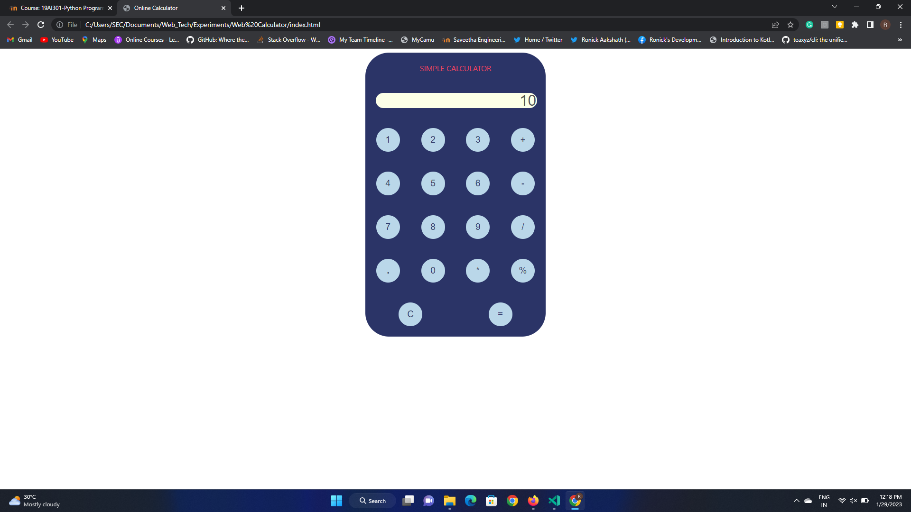

# Design of a Standard Calculator

## AIM:

To design a web application for a standard calculator.

## DESIGN STEPS:

### Step 1:
Clone the github repository and create Django admin interface.
### Step 2:
Change settings.py file to allow request from all hosts.
### Step 3:
Use CSS for creating attractive colors.
### Step 4:
Write JavaScript program for implementing five different operations.
### Step 5:
Validate the HTML and CSS code.
### Step 6:
Publish the website in the given URL.

## PROGRAM :
```
<!DOCTYPE html>
<html>
	<head>
		<title>Online Calculator</title>
		<script>
			function number(value){
				document.form1.result.value += value;
			}
			function cle(value) {
				document.form1.result.value=0;
			}
			function evalua() {
				//var evalu=eval(document.form1.result.value);
				document.form1.result.value=eval(document.form1.result.value);
			}
		</script>
		<style>
			table{
                border-radius: 50px;
				width: 20%;
                background-color: #2B3467;
                font-family: system-ui, -apple-system, BlinkMacSystemFont, 'Segoe UI', Roboto, Oxygen, Ubuntu, Cantarell, 'Open Sans', 'Helvetica Neue', sans-serif;
			}
			
			td{
				padding: 20px;
				width: 15px;
				height: 100%;
				color:#EB455F;
			}
			button{
				width: 50px;
				height: 50px;
				color:#2B3467;
                background-color: #BAD7E9;
				border-radius: 50px;
                border-style: hidden;
                font-size: larger;
			}
			input{
                border-radius: 20px;
                border-style: hidden;
				width:100%;
				height: 30px;
				background-color:#FCFFE7;
                font-size: xx-large;
			}
			button:hover{
				font-weight: bold;
			}
		</style>
	</head>
	<body>
		<form name="form1">
			<table align="center">
				<tr><td colspan="4" style="text-align:center">SIMPLE CALCULATOR</td></tr>
				<tr><td colspan="4">
					<input type="text" name="result" placeholder="0" disabled style="text-align:right"></input>
					</td>
				</tr>
				<tr align="center">
					<td><button type="button" onclick="number(value)" value="1">1</button></td>
					<td><button type="button" onclick="number(value)" value="2">2</button></td>
					<td><button type="button" onclick="number(value)" value="3">3</button></td>
					<td><button type="button" onclick="number(value)" value="+">+</button></td>
				</tr>
				<tr align="center">
					<td><button type="button" onclick="number(value)" value="4">4</button></td>
					<td><button type="button" onclick="number(value)" value="5">5</button></td>
					<td><button type="button" onclick="number(value)" value="6">6</button></td>
					<td><button type="button" onclick="number(value)" value="-">-</button></td>
				</tr>
				<tr align="center">
					<td><button type="button" onclick="number(value)" value="7">7</button></td>
					<td><button type="button" onclick="number(value)" value="8">8</button></td>
					<td><button type="button" onclick="number(value)" value="9">9</button></td>
					<td><button type="button" onclick="number(value)" value="/">/</button></td>
				</tr>
				<tr align="center">
					<td><button type="button" onclick="number(value)" value="."><strong>.</strong></button></td>
					<td><button type="button" onclick="number(value)" value="0">0</button></td>
					<td><button type="button" onclick="number(value)" value="*">*</button></td>
					<td><button type="button" onclick="number(value)" value="%">%</button></td>
				</tr>
				<tr align="center">
					<td colspan="2"><button type="button" onclick="cle(value)" value="C">C</button></td>
					<td colspan="2"><button type="button" onclick="evalua()" value='='>= </button></td>
				</tr>
			</table>
		</form>
	</body>
</html>
```
## OUTPUT:

## Result:
Thus a web application for standard calculator is designed.
